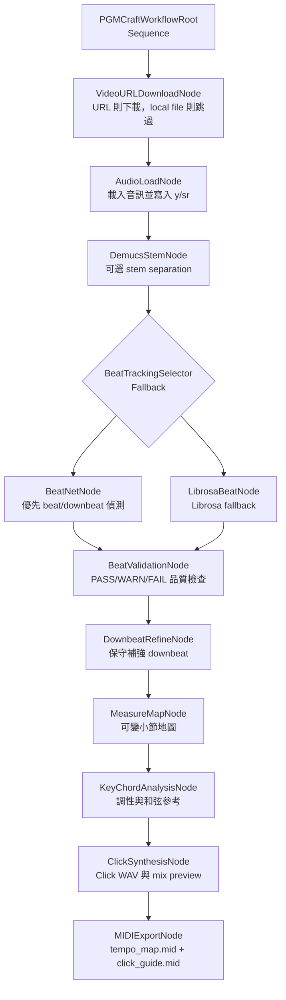
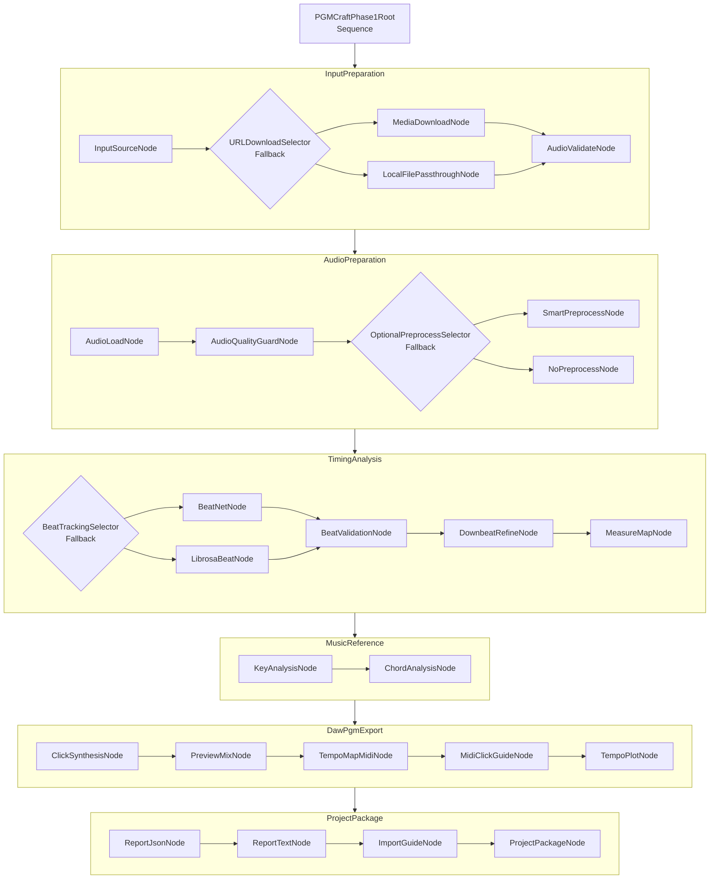

# Behavior Tree 設計圖

**最後更新：** 2026-07-22

本文件記錄 PGMCraft Studio 的 Behavior Tree 設計。所有圖都以 Markdown 形式保存，方便 GitHub 預覽、版本控管與後續討論。

## 設計原則

PGMCraft Studio 的工作流不應被寫成一條大型 procedural function，而應拆成節點，再由 Behavior Tree 負責串接。

核心規則：

- `SequenceNode`：必要流程依序執行，任一節點失敗即停止。
- `FallbackNode`：優先節點失敗時，嘗試下一個替代節點。
- `GuardNode`：檢查前置條件，決定是否允許某個分支執行。
- `ActionNode`：執行實際工作，例如下載、分析、合成、匯出。
- `Blackboard`：節點共享狀態，保存輸入、分析結果與輸出路徑。

## 目前已實作的 BT

目前主要工作流由 `pgm_craft/workflow/builder.py` 建立，節點實作集中在 `pgm_craft/workflow/audio_nodes.py`。

### ASCII 圖

```text
PGMCraftWorkflowRoot [Sequence]
├── VideoURLDownloadNode
├── AudioLoadNode
├── DemucsStemNode
├── BeatTrackingSelector [Fallback]
│   ├── BeatNetNode
│   └── LibrosaBeatNode
├── BeatValidationNode
├── DownbeatRefineNode
├── MeasureMapNode
├── KeyChordAnalysisNode
├── ClickSynthesisNode
└── MIDIExportNode
```

### Mermaid 圖



## 目前 BT 的節點責任

| 節點 | 類型 | 主要責任 | 目前狀態 |
|------|------|----------|----------|
| `VideoURLDownloadNode` | Action | 判斷 URL，必要時下載並取得 WAV | 已實作 |
| `AudioLoadNode` | Action | 載入音訊，寫入 `y`、`sr`、`target_analysis_path` | 已實作 |
| `DemucsStemNode` | Optional Action | 依 `enable_stem` 決定是否跑分軌 | 已實作流程，分軌品質目前仍偏 placeholder |
| `BeatNetNode` | Action | 優先使用 BeatNet 偵測節拍 | 已實作，依賴不足時會失敗 |
| `LibrosaBeatNode` | Fallback Action | BeatNet 不可用時改用 Librosa | 已實作 |
| `BeatValidationNode` | Guard / Action | 檢查 beat 數量、timestamp、BPM 範圍、BPM 跳動、downbeat 標籤與變動小節長度 | 已實作 v1 |
| `DownbeatRefineNode` | Action | 保留可信 downbeat；downbeat 不足時產生 4 拍候選並標記警告 | 已實作 v1 |
| `MeasureMapNode` | Action | 依 downbeat 切小節；缺 downbeat 時使用 4 拍 fallback 並標警告 | 已實作 v1 |
| `KeyChordAnalysisNode` | Action | 估算調性與小節和弦 | 已實作基礎版本 |
| `ClickSynthesisNode` | Action | 產生 click WAV 與原曲加 click 預聽檔 | 已實作 |
| `MIDIExportNode` | Action | 產生 `tempo_map.mid` 與 `click_guide.mid` | 已優化為 DAW tempo map + MIDI click guide |

## 目前 Blackboard 主要資料

| Key | 寫入節點 | 用途 |
|-----|----------|------|
| `audio_path` | workflow entry / `VideoURLDownloadNode` | 目前使用的音訊路徑 |
| `output_dir` | workflow entry | 產出目錄 |
| `enable_stem` | workflow entry | 是否啟用分軌 |
| `y` | `AudioLoadNode` | 載入後的音訊資料 |
| `sr` | `AudioLoadNode` | sample rate |
| `target_analysis_path` | `AudioLoadNode` / `DemucsStemNode` | beat 分析目標音檔 |
| `stems` | `DemucsStemNode` | 分軌結果 |
| `beats` | `BeatNetNode` / `LibrosaBeatNode` | 節拍與拍號標籤 |
| `beat_validation` | `BeatValidationNode` | beat 品質檢查結果 |
| `beat_confidence_level` | `BeatValidationNode` | `PASS`、`WARN` 或 `FAIL` |
| `beat_warnings` | `BeatValidationNode` | 可繼續但需人工確認的警告 |
| `beat_errors` | `BeatValidationNode` | 需停止流程的錯誤 |
| `beat_validation.stats.measure_lengths` | `BeatValidationNode` | 相鄰 downbeat 間的拍數統計，允許同曲變動 |
| `refined_beats` | `DownbeatRefineNode` | 補強 downbeat 標籤後的 beat 陣列，timestamp 不變 |
| `downbeat_refinement` | `DownbeatRefineNode` | downbeat 補強摘要、來源、警告與候選 |
| `downbeat_refine_status` | `DownbeatRefineNode` | `PASS`、`WARN` 或 `FAIL` |
| `downbeat_refine_warnings` | `DownbeatRefineNode` | downbeat 補強警告 |
| `downbeat_candidates` | `DownbeatRefineNode` | downbeat 候選位置 |
| `measure_map` | `MeasureMapNode` | 小節地圖，每一小節保留自己的 `beat_count` |
| `measure_map_status` | `MeasureMapNode` | `PASS`、`WARN` 或 `FAIL` |
| `measure_map_warnings` | `MeasureMapNode` | 小節地圖 fallback 或待人工確認警告 |
| `estimated_key` | `KeyChordAnalysisNode` | 推定調性 |
| `chord_progression` | `KeyChordAnalysisNode` | 小節和弦參考 |
| `click_track` | `ClickSynthesisNode` | click WAV 路徑 |
| `mix_with_click` | `ClickSynthesisNode` | 原曲加 click 預聽檔 |
| `tempo_map_midi` | `MIDIExportNode` | MIDI 匯出路徑 |
| `click_guide_midi` | `MIDIExportNode` | MIDI click guide 路徑 |

## Phase 1 目標 BT

Phase 1 的目標是聚焦在 PGM 與 DAW-ready 輸出。此階段不把 AI 分軌當成主要完成目標，而是先讓「音訊輸入 -> 節拍/速度分析 -> DAW 工程素材包」穩定。

### ASCII 圖

```text
PGMCraftPhase1Root [Sequence]
├── InputPreparation [Sequence]
│   ├── InputSourceNode
│   ├── URLDownloadSelector [Fallback]
│   │   ├── MediaDownloadNode
│   │   └── LocalFilePassthroughNode
│   └── AudioValidateNode
├── AudioPreparation [Sequence]
│   ├── AudioLoadNode
│   ├── AudioQualityGuardNode
│   └── OptionalPreprocessSelector [Fallback]
│       ├── SmartPreprocessNode
│       └── NoPreprocessNode
├── TimingAnalysis [Sequence]
│   ├── BeatTrackingSelector [Fallback]
│   │   ├── BeatNetNode
│   │   └── LibrosaBeatNode
│   ├── BeatValidationNode
│   ├── DownbeatRefineNode
│   └── MeasureMapNode
├── MusicReference [Sequence]
│   ├── KeyAnalysisNode
│   └── ChordAnalysisNode
├── DawPgmExport [Sequence]
│   ├── ClickSynthesisNode
│   ├── PreviewMixNode
│   ├── TempoMapMidiNode
│   ├── MidiClickGuideNode
│   └── TempoPlotNode
└── ProjectPackage [Sequence]
    ├── ReportJsonNode
    ├── ReportTextNode
    ├── ImportGuideNode
    └── ProjectPackageNode
```

### Mermaid 圖



## Phase 1 節點開發順序

建議依以下順序開發，因為每一步都會讓輸出更接近 DAW-ready：

1. `BeatValidationNode`：已完成 v1
2. `DownbeatRefineNode`：已完成 v1
3. `MeasureMapNode`：已完成 v1
4. `ProjectPackageNode`
5. `ImportGuideNode`
6. `ReportJsonNode` / `ReportTextNode` 整理

## Phase 1 新增 Blackboard Key 草案

| Key | 來源節點 | 用途 |
|-----|----------|------|
| `beat_validation` | `BeatValidationNode` | beat 數量、間距、BPM 範圍、小節長度變化是否可追蹤 |
| `beat_confidence_level` | `BeatValidationNode` | `PASS`、`WARN` 或 `FAIL` |
| `beat_warnings` | `BeatValidationNode` | 可繼續但需人工確認的警告 |
| `beat_errors` | `BeatValidationNode` | 需停止流程的錯誤 |
| `refined_beats` | `DownbeatRefineNode` | 補強 downbeat 標籤後的 beat 陣列，timestamp 不變 |
| `downbeat_refinement` | `DownbeatRefineNode` | downbeat 補強摘要、來源、警告與候選 |
| `measure_map` | `MeasureMapNode` | 小節、拍點、downbeat 的結構化資料 |
| `measure_map_status` | `MeasureMapNode` | `PASS`、`WARN` 或 `FAIL` |
| `measure_map_warnings` | `MeasureMapNode` | 小節地圖 fallback 或待人工確認警告 |
| `tempo_events` | `TempoMapMidiNode` | MIDI tempo map 所需事件 |
| `click_guide_midi` | `MidiClickGuideNode` | DAW click guide MIDI 路徑 |
| `project_package_dir` | `ProjectPackageNode` | 工程素材包根目錄 |
| `import_guide` | `ImportGuideNode` | DAW 匯入說明路徑 |
| `reports` | `ReportJsonNode` / `ReportTextNode` | 報告檔集合 |

## 與 AI Extension 的關係

AI 分軌、Podcast AI、Basic Pitch、CREPE 等功能不應阻塞 Phase 1。它們未來可以接在以下位置：

```text
AudioPreparation 後
├── OptionalAIStemBranch [Guard + Optional Action]
├── OptionalTranscriptionBranch [Guard + Optional Action]
└── OptionalPitchBranch [Guard + Optional Action]
```

原則：

- AI extension 必須是 optional。
- 缺依賴時不應讓 PGM/DAW 核心流程失敗。
- AI branch 的輸出可以進入 `ProjectPackageNode`，但不能成為 Phase 1 核心必要條件。

## 下一步討論焦點

下一輪應先確認 `ProjectPackageNode` 與 `ImportGuideNode` 的輸出結構，讓目前已完成的 beat validation、downbeat refinement、measure map、MIDI 與報告可以被整理成穩定工程素材包。
