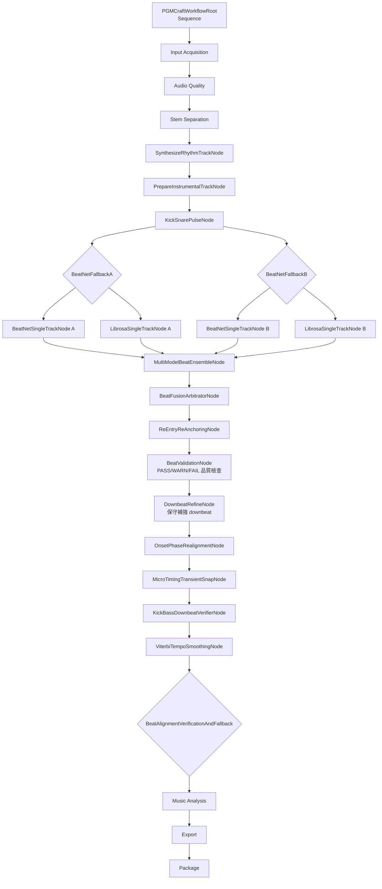
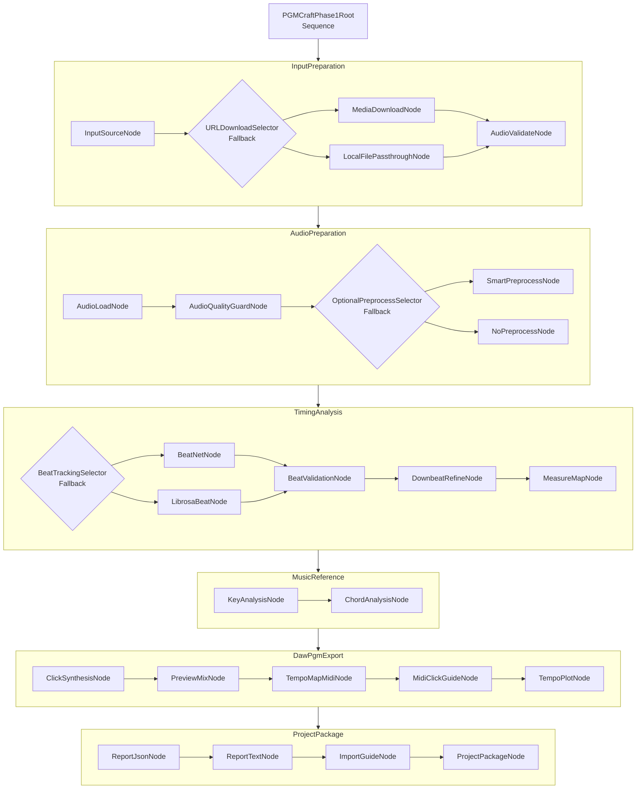

# Behavior Tree 設計圖

**最後更新：** 2026-07-29

本文件記錄 PGMCraft Studio 的 Behavior Tree 設計。所有圖都以 Markdown 形式保存，方便 GitHub 預覽、版本控管與後續討論。

## 設計原則

PGMCraft Studio 的工作流不應被寫成一條大型 procedural function，而應拆成節點，再由 Behavior Tree 負責串接。

核心規則：

- `SequenceNode`：必要流程依序執行，任一節點失敗即停止。
- `FallbackNode`：優先節點失敗時，嘗試下一個替代節點。
- `GuardNode`：檢查前置條件，決定是否允許某個分支執行。
- `ActionNode`：執行實際工作，例如下載、分析、合成、匯出。
- `Blackboard`：節點共享狀態，保存輸入、分析結果與輸出路徑。

## 目前已實作的 BT

目前主要工作流由 `pgm_craft/workflow/builder.py` 建立，節點實作分散於 `pgm_craft/workflow/audio_nodes.py`、`pgm_craft/workflow/beat_tracking_bt.py`、`pgm_craft/workflow/export_bt.py` 等模組。

`target_stage="module3"` 走模塊三專用測試工作流，用於手動測試節拍分析、切分/提前音判讀、click 打點與去人聲伴奏加 click。它與完整 Stage 3 共用同一系列 beat tracking 節點，但不直接跑完整 Stage 5/6。

### ASCII 圖

```text
PGMCraftWorkflowRoot [Sequence]
├── Input Acquisition
├── Audio Quality
├── Stem Separation
├── BeatTrackingRoot [Sequence]
│   ├── SynthesizeRhythmTrackNode
│   ├── PrepareInstrumentalTrackNode
│   ├── KickSnarePulseNode
│   ├── TrackA_RhythmBranch
│   │   └── BeatNetFallbackA [BeatNetSingleTrackNode -> LibrosaSingleTrackNode]
│   ├── TrackB_InstrumentalBranch
│   │   └── BeatNetFallbackB [BeatNetSingleTrackNode -> LibrosaSingleTrackNode]
│   ├── MultiModelBeatEnsembleNode
│   ├── BeatFusionArbitratorNode
│   ├── ReEntryReAnchoringNode
│   ├── BeatValidationNode
│   ├── DownbeatRefineNode
│   ├── OnsetPhaseRealignmentNode
│   ├── MicroTimingTransientSnapNode
│   ├── KickBassDownbeatVerifierNode
│   ├── ViterbiTempoSmoothingNode
│   └── BeatAlignmentVerificationAndFallback
├── Music Analysis
├── Export
└── Package
```

### Module 3 節拍與 Click 測試 BT

```text
Module3BeatClickRoot [Sequence]
├── InputAcquisitionRoot
├── AudioQualityRoot
├── OptionalStemSeparationNode
├── CandidateTrackBuildNode
│   ├── full_mix  = 原曲 / 降噪音檔
│   ├── rhythm    = drums + bass
│   ├── band      = drums + bass + guitar + piano / no_vocals
│   └── vocal     = vocals / lead_vocal
├── SynthesizeRhythmTrackNode              # 共用 Stage 3 preparation
├── PrepareInstrumentalTrackNode           # 共用 Stage 3 preparation
├── KickSnarePulseNode                     # 共用 Stage 3 preparation
├── TrackA_RhythmBranch                    # 共用 Stage 3 dual-track analysis
├── TrackB_InstrumentalBranch              # 共用 Stage 3 dual-track analysis
├── MultiModelBeatEnsembleNode             # 共用 Stage 3 fusion
├── BeatFusionArbitratorNode               # 共用 Stage 3 fusion
├── PerTrackBeatAnalysisNode
├── SegmentGridNode
├── PerSegmentConfidenceNode
├── SegmentSourceAttributionNode
├── BeatGridSynthesisNode
├── ReEntryReAnchoringNode                 # 共用 Stage 3 refinement guard
├── BeatValidationNode                     # 共用 Stage 3 refinement guard
├── DownbeatRefineNode                     # 共用 Stage 3 refinement guard
├── OnsetPhaseRealignmentNode              # 共用 Stage 3 refinement guard
├── MicroTimingTransientSnapNode           # 共用 Stage 3 refinement guard
├── KickBassDownbeatVerifierNode           # 共用 Stage 3 refinement guard
├── ViterbiTempoSmoothingNode              # 共用 Stage 3 refinement guard
├── BeatAlignmentVerificationAndFallback   # 共用 Stage 3 fallback guard
├── MusicAnalysisRoot
├── SubdivisionGridNode
├── SyncopationClassificationNode
└── Module3ExportRoot
    ├── ClickSynthesisNode
    ├── Module3BackingWithClickNode
    └── Module3OutputSummaryNode
```

此路徑的核心原則：

- 不把四軌候選全曲選一軌，而是按小節或段落寫出 `segment_source_map`。
- 模塊三與完整全自動 Stage 3 使用同一系列節點；差異在於模塊三於 Stage 3 dual-track fusion 後插入 `PerTrackBeatAnalysisNode` 到 `BeatGridSynthesisNode` 的分段可信度合成，再交回 Stage 3 refinement guards。
- `BeatGridSynthesisNode` 依每段 primary/supporting source 合成唯一 `beats` / `refined_beats`，之後仍會經過 onset phase、transient snap、downbeat verifier 與 tempo smoothing。
- `SubdivisionGridNode` 建立 8 分音符分析 grid，但 `click_grid` 維持 4 分音符。
- `SyncopationClassificationNode` 標記切分音、提前音與 phrase onset，避免 click 被非拍點 transient 拉走。
- `Module3ExportRoot` 只輸出模塊三必要檔案，不跑 DAW marker、lyrics marker、voice cue、IEM、完整 package；沒有 no-vocal/instrumental stem 時不假裝產生純音樂伴奏。
- `PGMCraftEngine.run(target_stage="module3")` 不建立 `pgm_project_package`，只回傳 `project_package_status="SKIPPED_MODULE3_TEST_PROJECT"`。

Module 3 output layout:

```text
{output_root}/{project_name}/
├── source/
│   ├── *_raw.wav
│   ├── *_normalized.wav
│   └── *_denoised.wav
├── stems/                    # enable_stem=true 時包含候選 stems/submix
├── click/
│   ├── click_track.wav
│   ├── mix_with_click.wav
│   └── backing_with_click.wav # 只有 no_vocals/instrumental 存在時產生
└── reports/
    ├── module3_beat_click_report.json
    ├── module3_pipeline_report.json
    └── tempo_curve.png
```

### Mermaid 圖



## 目前 BT 的節點責任

| 節點 | 類型 | 主要責任 | 目前狀態 |
|------|------|----------|----------|
| `VideoURLDownloadNode` | Action | 判斷 URL，必要時下載並取得 WAV | 已實作 |
| `AudioLoadNode` | Action | 載入音訊，寫入 `y`、`sr`、`target_analysis_path` | 已實作 |
| `StemSeparationRoot` | Optional Sequence | 依 `enable_stem` 建立可供節拍、和聲、匯出的 stems | 已實作流程，分軌品質仍需真實模型驗證 |
| `SynthesizeRhythmTrackNode` | Action | 合成 drums+bass rhythm track，缺軌時 fallback 到既有 submix 或原曲 | 已實作 |
| `PrepareInstrumentalTrackNode` | Action | 選擇 no_vocals / instrumental 作為 B 軌 | 已實作 |
| `KickSnarePulseNode` | Action / Guard Data | 從 kick、snare、bass stem 提取脈衝錨點 | 已實作 |
| `BeatNetSingleTrackNode` | Action | 分別對 A/B 軌使用 BeatNet 偵測 beat/downbeat | 已實作，依賴不足時會失敗 |
| `LibrosaSingleTrackNode` | Fallback Action | A/B 軌 BeatNet 不可用時改用 Librosa | 已實作 |
| `TrackValidationNode` | Guard / Action | 對單軌 beat 計算 confidence | 已實作 |
| `MultiModelBeatEnsembleNode` | Action | 對 A/B 軌候選拍點做時間窗口共識融合 | 已實作 |
| `BeatFusionArbitratorNode` | Action | 依 A 軌能量與 A/B confidence 選擇或補全拍點 | 已實作 |
| `ReEntryReAnchoringNode` | Guard / Action | 偵測無鼓到有鼓 re-entry，重錨 downbeat phase | 已實作 |
| `BeatValidationNode` | Guard / Action | 檢查 beat 數量、timestamp、BPM 範圍、BPM 跳動、downbeat 標籤與變動小節長度 | 已實作 v1 |
| `DownbeatRefineNode` | Action | 保留可信 downbeat；downbeat 不足時產生 4 拍候選並標記警告 | 已實作，會同步 `beats` 與 `refined_beats` |
| `OnsetPhaseRealignmentNode` | Guard / Action | 在 onset strength ±35ms 內微調 beat timestamp | 已實作 |
| `MicroTimingTransientSnapNode` | Guard / Action | 對 drums / 原曲 transient peak 做更細緻 snap | 已實作 |
| `KickBassDownbeatVerifierNode` | Guard / Action | 以低頻能量檢查 downbeat 是否 180 度反相 | 已實作 |
| `ViterbiTempoSmoothingNode` | Guard / Action | 平滑孤立 interval outlier，保留為 guard 而非絕對校正 | 已實作 |
| `BeatAlignmentVerifierGuardNode` | Guard | 檢查 section / kick anchor 與 beat/downbeat 的閉環對齊 | 已實作 |
| `DrumsKickBeatFallbackNode` | Fallback Action | 閉環對齊失敗時用鼓軌或原曲重算 beat | 已實作 |
| `MeasureMapNode` | Action | 依 downbeat 切小節；缺 downbeat 時使用 4 拍 fallback 並標警告 | 已實作 v1 |
| `KeyChordAnalysisNode` | Action | 估算調性與小節和弦 | 已實作基礎版本 |
| `ClickSynthesisNode` | Action | 產生 click WAV 與原曲加 click 預聽檔 | 已實作 |
| `MIDIExportNode` | Action | 產生 `tempo_map.mid` 與 `click_guide.mid` | 已優化為 DAW tempo map + MIDI click guide |

## 目前 Blackboard 主要資料

| Key | 寫入節點 | 用途 |
|-----|----------|------|
| `audio_path` | workflow entry / `VideoURLDownloadNode` | 目前使用的音訊路徑 |
| `output_dir` | workflow entry | 產出目錄 |
| `enable_stem` | workflow entry | 是否啟用分軌 |
| `y` | `AudioLoadNode` | 載入後的音訊資料 |
| `sr` | `AudioLoadNode` | sample rate |
| `target_analysis_path` | `AudioLoadNode` / `DemucsStemNode` | beat 分析目標音檔 |
| `stems` | `DemucsStemNode` | 分軌結果 |
| `rhythm_track_path` | `SynthesizeRhythmTrackNode` | A 軌節奏骨幹分析目標 |
| `inst_track_path` | `PrepareInstrumentalTrackNode` | B 軌伴奏分析目標 |
| `beats_rhythm` | `BeatNetSingleTrackNode` / `LibrosaSingleTrackNode` | A 軌候選節拍 |
| `beats_inst` | `BeatNetSingleTrackNode` / `LibrosaSingleTrackNode` | B 軌候選節拍 |
| `conf_rhythm` | `TrackValidationNode` | A 軌節拍 confidence |
| `conf_inst` | `TrackValidationNode` | B 軌節拍 confidence |
| `kick_anchors` | `KickSnarePulseNode` | kick / sub-bass 脈衝錨點 |
| `snare_anchors` | `KickSnarePulseNode` | snare 脈衝錨點 |
| `ensemble_beats` | `MultiModelBeatEnsembleNode` | A/B 軌共識候選 |
| `ensemble_confidence` | `MultiModelBeatEnsembleNode` | A/B 軌共識比例 |
| `beat_fusion_report` | `BeatFusionArbitratorNode` | A/B 軌融合統計 |
| `beats` | Stage 3 canonical beat chain | 目前最新版節拍與拍號標籤，後處理節點會持續覆寫 |
| `beat_validation` | `BeatValidationNode` | beat 品質檢查結果 |
| `beat_confidence_level` | `BeatValidationNode` | `PASS`、`WARN` 或 `FAIL` |
| `beat_warnings` | `BeatValidationNode` | 可繼續但需人工確認的警告 |
| `beat_errors` | `BeatValidationNode` | 需停止流程的錯誤 |
| `beat_validation.stats.measure_lengths` | `BeatValidationNode` | 相鄰 downbeat 間的拍數統計，允許同曲變動 |
| `refined_beats` | `DownbeatRefineNode` / snap / smoothing / fallback | 與 canonical `beats` 同步的最終 beat 陣列 |
| `downbeat_refinement` | `DownbeatRefineNode` | downbeat 補強摘要、來源、警告與候選 |
| `downbeat_refine_status` | `DownbeatRefineNode` | `PASS`、`WARN` 或 `FAIL` |
| `downbeat_refine_warnings` | `DownbeatRefineNode` | downbeat 補強警告 |
| `downbeat_candidates` | `DownbeatRefineNode` | downbeat 候選位置 |
| `phase_realignment_report` | `OnsetPhaseRealignmentNode` | onset 相位微調統計 |
| `snap_offsets_ms` | `MicroTimingTransientSnapNode` | transient snap 偏移量 |
| `downbeat_fix_report` | `KickBassDownbeatVerifierNode` | 低頻 downbeat 修正摘要 |
| `smoothing_report` | `ViterbiTempoSmoothingNode` | interval outlier 平滑摘要 |
| `beat_alignment_score` | `BeatAlignmentVerifierGuardNode` | section/kick anchor 閉環對齊分數 |
| `fallback_beat_recalculated` | `DrumsKickBeatFallbackNode` | 是否啟動鼓軌 fallback 重算 |
| `measure_map` | `MeasureMapNode` | 小節地圖，每一小節保留自己的 `beat_count` |
| `measure_map_status` | `MeasureMapNode` | `PASS`、`WARN` 或 `FAIL` |
| `measure_map_warnings` | `MeasureMapNode` | 小節地圖 fallback 或待人工確認警告 |
| `estimated_key` | `KeyChordAnalysisNode` | 推定調性 |
| `chord_progression` | `KeyChordAnalysisNode` | 小節和弦參考 |
| `click_track` | `ClickSynthesisNode` | click WAV 路徑 |
| `mix_with_click` | `ClickSynthesisNode` | 原曲加 click 預聽檔 |
| `beat_candidate_tracks` | `CandidateTrackBuildNode` | 模塊三 full/rhythm/band/vocal 四軌候選來源 |
| `beat_candidates` | `PerTrackBeatAnalysisNode` | 模塊三每軌 beat candidates |
| `analysis_segments` | `SegmentGridNode` | 模塊三分段可信度分析區間 |
| `per_segment_confidence` | `PerSegmentConfidenceNode` | 每段每軌可信度 |
| `segment_source_map` | `SegmentSourceAttributionNode` | 每段 primary/supporting timing source |
| `beat_synthesis_report` | `BeatGridSynthesisNode` | 最終 beat grid 合成摘要 |
| `subdivision_grid` | `SubdivisionGridNode` | 8 分音符分析 grid |
| `click_grid` | `SubdivisionGridNode` | 4 分音符 click grid |
| `syncopation_events` | `SyncopationClassificationNode` | 切分音、提前音、phrase onset 標註 |
| `module3_outputs` | `Module3OutputSummaryNode` / `PGMCraftEngine` | 模塊三 output manifest：測試專案資料夾、source/stems/click/reports 路徑、候選軌、click、report |
| `module3_report_json` | `Module3OutputSummaryNode` | 模塊三手動測試報告 |
| `tempo_map_midi` | `MIDIExportNode` | MIDI 匯出路徑 |
| `click_guide_midi` | `MIDIExportNode` | MIDI click guide 路徑 |
| `workflow_status` | `BTWorkflowEngine` | 整體 BT 執行狀態 |
| `workflow_trace` | `BaseNode.run()` | 每個 BT 節點的執行順序、狀態、父節點與耗時 |

## Workflow Trace v1

`BaseNode.run()` 會包裝節點執行並在 blackboard 的 `workflow_trace` 中追加 trace entry。`SequenceNode` 與 `FallbackNode` 透過 `child.run(...)` 執行子節點，因此完整 BT engine 執行後可檢查每個節點的結果。

Trace entry 格式：

```json
{
  "index": 0,
  "node": "AudioLoadNode",
  "node_type": "AudioLoadNode",
  "parent": "PGMCraftWorkflowRoot",
  "status": "SUCCESS",
  "duration_ms": 12.345
}
```

若節點丟出未處理 exception，trace entry 會以 `FAILURE` 記錄並帶上 `error` 欄位，然後重新拋出例外。`PGMCraftEngine` 會將 `workflow_status` 與 `workflow_trace` 寫入 `pgm_report.json`。

`PGMCraftEngine` 也會將完整 `beats`、`refined_beats` 與 `beat_precision_diagnostics` 寫入 `pgm_report.json`。這些資料不是新的 BT 節點輸出，而是 Stage 3 blackboard 結果的 report serialization，用於後續 reference annotation 評估與 DAW grid 對拍。

CLI reference 評估範例：

```bash
pgm-craft --audio song.wav --output outputs/song_eval --reference-beats annotations/beats.txt --reference-downbeats annotations/downbeats.txt
```

輸出的 `beat_evaluation.json` 會記錄 70 ms matching window 下的 precision、recall、F-measure 與 matched beat offset 統計。

## Phase 1 目標 BT

Phase 1 的目標是聚焦在 PGM 與 DAW-ready 輸出。此階段不把 AI 分軌當成主要完成目標，而是先讓「音訊輸入 -> 節拍/速度分析 -> DAW 工程素材包」穩定。

### ASCII 圖

```text
PGMCraftPhase1Root [Sequence]
├── InputPreparation [Sequence]
│   ├── InputSourceNode
│   ├── URLDownloadSelector [Fallback]
│   │   ├── MediaDownloadNode
│   │   └── LocalFilePassthroughNode
│   └── AudioValidateNode
├── AudioPreparation [Sequence]
│   ├── AudioLoadNode
│   ├── AudioQualityGuardNode
│   └── OptionalPreprocessSelector [Fallback]
│       ├── SmartPreprocessNode
│       └── NoPreprocessNode
├── TimingAnalysis [Sequence]
│   ├── BeatTrackingSelector [Fallback]
│   │   ├── BeatNetNode
│   │   └── LibrosaBeatNode
│   ├── BeatValidationNode
│   ├── DownbeatRefineNode
│   └── MeasureMapNode
├── MusicReference [Sequence]
│   ├── KeyAnalysisNode
│   └── ChordAnalysisNode
├── DawPgmExport [Sequence]
│   ├── ClickSynthesisNode
│   ├── PreviewMixNode
│   ├── TempoMapMidiNode
│   ├── MidiClickGuideNode
│   └── TempoPlotNode
└── ProjectPackage [Sequence]
    ├── ReportJsonNode
    ├── ReportTextNode
    ├── ImportGuideNode
    └── ProjectPackageNode
```

### Mermaid 圖



## Phase 1 節點開發順序

建議依以下順序開發，因為每一步都會讓輸出更接近 DAW-ready：

1. `BeatValidationNode`：已完成 v1
2. `DownbeatRefineNode`：已完成 v1
3. `MeasureMapNode`：已完成 v1
4. `PGMProjectPackager`：已完成 v1，目前在 pipeline 收尾階段執行
5. `ProjectPackageNode` / `ImportGuideNode`：Phase 2 可完全節點化
6. `ReportJsonNode` / `ReportTextNode` 整理

## Phase 1 新增 Blackboard Key 草案

| Key | 來源節點 | 用途 |
|-----|----------|------|
| `beat_validation` | `BeatValidationNode` | beat 數量、間距、BPM 範圍、小節長度變化是否可追蹤 |
| `beat_confidence_level` | `BeatValidationNode` | `PASS`、`WARN` 或 `FAIL` |
| `beat_warnings` | `BeatValidationNode` | 可繼續但需人工確認的警告 |
| `beat_errors` | `BeatValidationNode` | 需停止流程的錯誤 |
| `refined_beats` | `DownbeatRefineNode` | 補強 downbeat 標籤後的 beat 陣列，timestamp 不變 |
| `downbeat_refinement` | `DownbeatRefineNode` | downbeat 補強摘要、來源、警告與候選 |
| `measure_map` | `MeasureMapNode` | 小節、拍點、downbeat 的結構化資料 |
| `measure_map_status` | `MeasureMapNode` | `PASS`、`WARN` 或 `FAIL` |
| `measure_map_warnings` | `MeasureMapNode` | 小節地圖 fallback 或待人工確認警告 |
| `tempo_events` | `TempoMapMidiNode` | MIDI tempo map 所需事件 |
| `click_guide_midi` | `MidiClickGuideNode` | DAW click guide MIDI 路徑 |
| `project_package_dir` | `ProjectPackageNode` | 工程素材包根目錄 |
| `import_guide` | `ImportGuideNode` | DAW 匯入說明路徑 |
| `reports` | `ReportJsonNode` / `ReportTextNode` | 報告檔集合 |

補充：目前 v1 由 `pgm_craft/packager.py` 的 `PGMProjectPackager` 在 pipeline 收尾階段建立工程素材包，尚未完全移入 BT 節點。

## 與 AI Extension 的關係

AI 分軌、Podcast AI、Basic Pitch、CREPE 等功能不應阻塞 Phase 1。它們未來可以接在以下位置：

```text
AudioPreparation 後
├── OptionalAIStemBranch [Guard + Optional Action]
├── OptionalTranscriptionBranch [Guard + Optional Action]
└── OptionalPitchBranch [Guard + Optional Action]
```

原則：

- AI extension 必須是 optional。
- 缺依賴時不應讓 PGM/DAW 核心流程失敗。
- AI branch 的輸出可以進入 `ProjectPackageNode`，但不能成為 Phase 1 核心必要條件。

## 下一步討論焦點

GitHub remote、CI、release 與 public visibility 檢查已完成。下一輪可聚焦公開後回饋與 Phase 2 節點工作流強化。
