# PGMCraft Studio — 兩階層狀態機工作流 SDD 規範文件 (Workflow State Machine Architecture)

## 📌 概述
本文件為 PGMCraft Studio 音訊處理系統中 **「兩階層目標驅動應用場景狀態機 (Two-Tier Scenario State Machines)」** 之正式 SDD 設計規範。
每一條工作流均由一組獨立的 **Behavior Tree (BT) 狀態機** 驅動，嚴格遵照單一責任原則、Blackboard 狀態讀寫與極限聲學護航防護。

---

## 🎙️ 大場景 1：Podcast 播客與口播節目 (Podcasting & Speech)

### 1-1. 雙人/多人訪談聲音淨化工作流 (`podcast_interview_clean`)

#### 🎯 目標與聲學指標
- **目標**：修復帶有空調風聲、低頻 50/60Hz 電流聲、房間迴音與聲音大小不均的訪談錄音。
- **目標 LUFS**：`-16.0 LUFS` (Podcast 國際廣播規範)
- **True Peak 護航**：`-1.0 dBFS` (防止解碼器 True Peak 剪峰失真)

#### 🧬 狀態機 Behavior Tree 鏈路圖 (Node Chain)

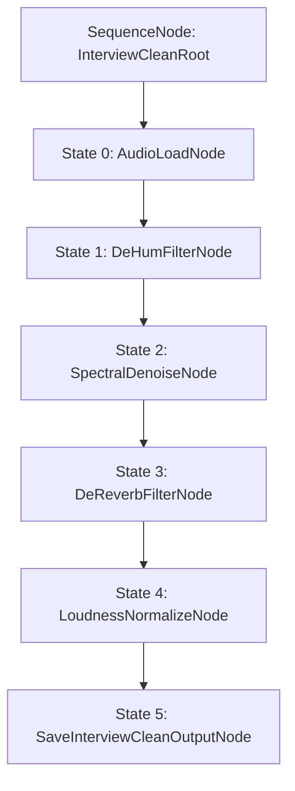

#### 🔑 Blackboard 黑板資料契約 (Blackboard State Contract)

| Key Name | Data Type | Source Node | Consumer Node | 說明 |
|---|---|---|---|---|
| `audio_path` | `str` | UI / User Input | `AudioLoadNode` | 原始輸入音檔路徑 |
| `y` | `np.ndarray` | `AudioLoadNode` | `DeHum`, `Denoise`, `DeReverb`, `Normalize` | 音訊時域浮點波形 (float32) |
| `sr` | `int` | `AudioLoadNode` | `DeHum`, `Denoise`, `DeReverb`, `Normalize` | 音訊採樣率 (Hz) |
| `target_lufs` | `float` | `LoudnessNormalizeNode` | `LoudnessNormalizeNode` | 預設為 `-16.0 LUFS` |
| `clean_speech_path` | `str` | `SaveInterviewCleanOutputNode` | Web UI / Downloader | 淨化完成之 WAV 音檔落盤路徑 |

#### 🛡️ 異常與衛兵保護 (Guards & Fallbacks)
1. **直流偏置 (DC Offset Guard)**：`LoudnessNormalizeNode` 自動先清算 10Hz 低通濾波偏置，避免音圈偏移。
2. **單/雙聲道自動適應 (Channel Auto-shape)**：`SaveInterviewCleanOutputNode` 自動探測波形維度 (1D / 2D)，防止音軌 shape 轉置錯位。

---

### 1-2. 播客音量 EBU R128 自動標準化與防剪峰工作流 (`podcast_r128_normalize`)

#### 🎯 目標與聲學指標
- **目標**：專注平滑音量調整，消除音量忽大忽小問題，嚴格達成 Spotify / Apple Podcast 規範。
- **目標 LUFS**：`-16.0 LUFS`
- **True Peak 上限**：`-1.0 dBFS` (Soft Knee Limiter 防剪峰)

#### 🧬 狀態機 Behavior Tree 鏈路圖 (Node Chain)

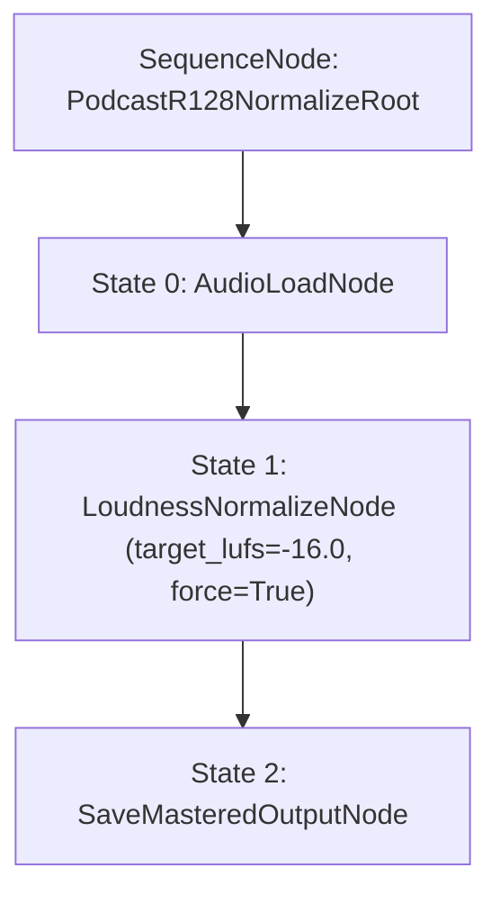

#### 🔑 Blackboard 黑板資料契約 (Blackboard State Contract)

| Key Name | Data Type | Source Node | Consumer Node | 說明 |
|---|---|---|---|---|
| `audio_path` | `str` | UI / User Input | `AudioLoadNode` | 原始輸入音檔路徑 |
| `y` | `np.ndarray` | `AudioLoadNode` | `LoudnessNormalizeNode` | 音訊時域浮點波形 |
| `mastered_speech_path` | `str` | `SaveMasteredOutputNode` | Web UI | Master 完成之音量標準化檔 |

---

### 1-3. Talking Head 獨立語音抽出與背景音分離工作流 (`podcast_voice_isolation`)

#### 🎯 目標與聲學指標
- **目標**：從口播或影片中抽離「純口播說話聲」與「純背景 BGM 音樂軌」。

#### 🧬 狀態機 Behavior Tree 鏈路圖 (Node Chain)

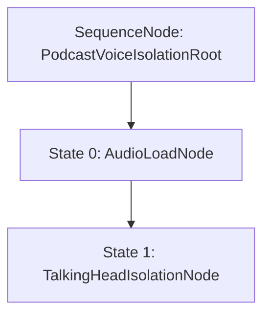

#### 🔑 Blackboard 黑板資料契約 (Blackboard State Contract)

| Key Name | Data Type | Source Node | Consumer Node | 說明 |
|---|---|---|---|---|
| `audio_path` | `str` | UI / User Input | `AudioLoadNode` | 原始輸入音檔路徑 |
| `isolated_speech_path` | `str` | `TalkingHeadIsolationNode` | Web UI | 抽離出之純口播語音檔 (`Talking_Head_Speech.wav`) |
| `isolated_bgm_path` | `str` | `TalkingHeadIsolationNode` | Web UI | 抽離出之純背景 BGM 檔 (`Talking_Head_BGM.wav`) |

---

## 📹 大場景 2：影音創作者與自媒體剪輯 (Vlog & Video Production)

### 2-1. 戶外外景低頻風切聲與車流雜音降噪工作流 (`vlog_wind_env_clean`)

#### 🎯 目標與聲學指標
- **目標**：消除戶外手持 Vlog 或外景錄影之 < 80Hz 極低頻風切爆音 (Wind Popping & Rumble) 與背景車流頻譜。
- **目標 LUFS**：`-14.0 LUFS` (YouTube / Vlog 影片標準音量)
- **True Peak 上限**：`-1.0 dBFS`

#### 🧬 狀態機 Behavior Tree 鏈路圖 (Node Chain)

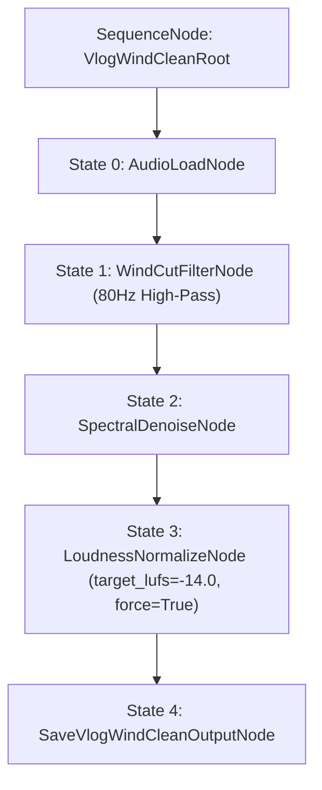

#### 🔑 Blackboard 黑板資料契約 (Blackboard State Contract)

| Key Name | Data Type | Source Node | Consumer Node | 說明 |
|---|---|---|---|---|
| `audio_path` | `str` | UI / User Input | `AudioLoadNode` | 原始輸入音檔路徑 |
| `vlog_clean_path` | `str` | `SaveVlogWindCleanOutputNode` | Web UI | 淨化完成之 Vlog WAV 音檔落盤路徑 (`vlog_wind_cleaned.wav`) |

---

### 2-2. 影片對白與背景音樂 (BGM) 二分抽離工作流 (`vlog_dialogue_bgm_split`)

#### 🎯 目標與聲學指標
- **目標**：從 Vlog 或影片中抽離「人物講話對白」與「純影片背景 BGM 音樂軌」。

#### 🧬 狀態機 Behavior Tree 鏈路圖 (Node Chain)

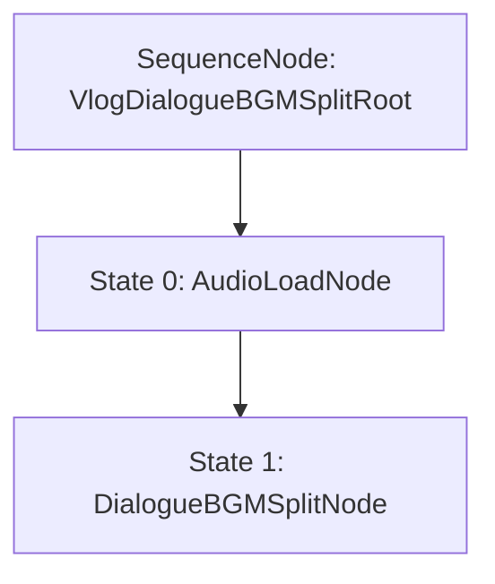

#### 🔑 Blackboard 黑板資料契約 (Blackboard State Contract)

| Key Name | Data Type | Source Node | Consumer Node | 說明 |
|---|---|---|---|---|
| `audio_path` | `str` | UI / User Input | `AudioLoadNode` | 原始輸入音檔路徑 |
| `isolated_dialogue_path` | `str` | `DialogueBGMSplitNode` | Web UI | 抽離出之純人物對白檔 (`Vlog_Dialogue_Only.wav`) |
| `isolated_bgm_path` | `str` | `DialogueBGMSplitNode` | Web UI | 抽離出之純背景 BGM 檔 (`Vlog_Clean_BGM.wav`) |

---

### 2-3. 展覽/街頭人聲高亮與人群雜音剝離工作流 (`vlog_speech_enhance`)

#### 🎯 目標與聲學指標
- **目標**：剝離展覽、街訪、人群擁擠處之尖叫歡呼雜音，聚焦強化主講語音共振峰 (300Hz ~ 3400Hz)。
- **目標 LUFS**：`-14.0 LUFS`

#### 🧬 狀態機 Behavior Tree 鏈路圖 (Node Chain)

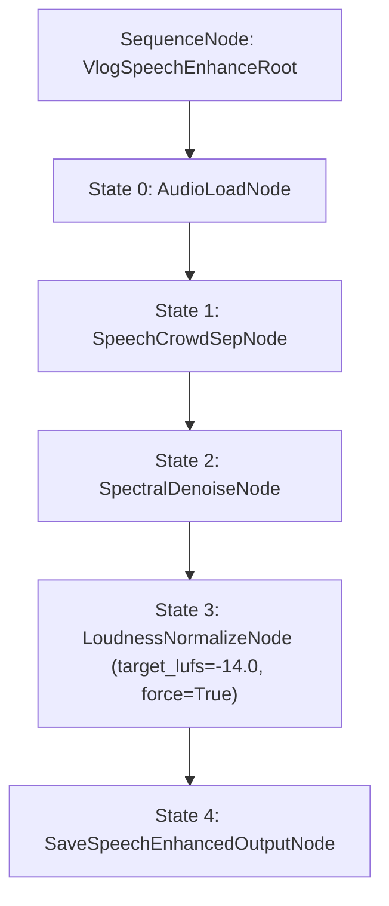

#### 🔑 Blackboard 黑板資料契約 (Blackboard State Contract)

| Key Name | Data Type | Source Node | Consumer Node | 說明 |
|---|---|---|---|---|
| `audio_path` | `str` | UI / User Input | `AudioLoadNode` | 原始輸入音檔路徑 |
| `vlog_enhanced_path` | `str` | `SaveSpeechEnhancedOutputNode` | Web UI | 語音高亮淨化完成檔 (`vlog_speech_enhanced.wav`) |

---

## 🎤 大場景 3：歌唱與伴奏製作 (Vocal & Karaoke)

### 3-1. 經典純伴奏製作工作流 (`vocal_pure_inst`)

#### 🎯 目標與聲學指標
- **目標**：從原曲中完全去除主唱與和聲，產出無人聲純淨伴奏。
- **目標 LUFS**：`-14.0 LUFS`
- **True Peak 上限**：`-1.0 dBFS`

#### 🧬 狀態機 Behavior Tree 鏈路圖 (Node Chain)

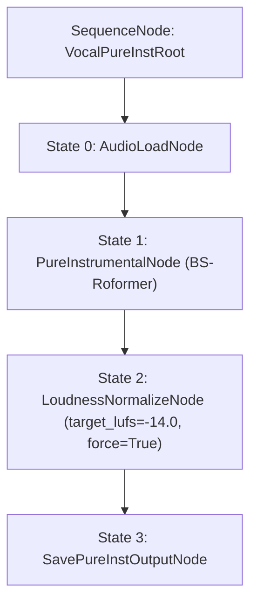

#### 🔑 Blackboard 黑板資料契約 (Blackboard State Contract)

| Key Name | Data Type | Source Node | Consumer Node | 說明 |
|---|---|---|---|---|
| `audio_path` | `str` | UI / User Input | `AudioLoadNode` | 原始原曲音檔路徑 |
| `pure_inst_path` | `str` | `SavePureInstOutputNode` | Web UI | 淨化落盤之純伴奏 WAV 路徑 (`Pure_Instrumental.wav`) |

---

### 3-2. 帶和聲伴奏製作工作流 (`vocal_backing_inst`)

#### 🎯 目標與聲學指標
- **目標**：從原曲中去除去主唱 (Lead Vocal)，但完整保留配唱和聲 (Backing Vocals) 與器樂伴奏。
- **目標 LUFS**：`-14.0 LUFS`

#### 🧬 狀態機 Behavior Tree 鏈路圖 (Node Chain)

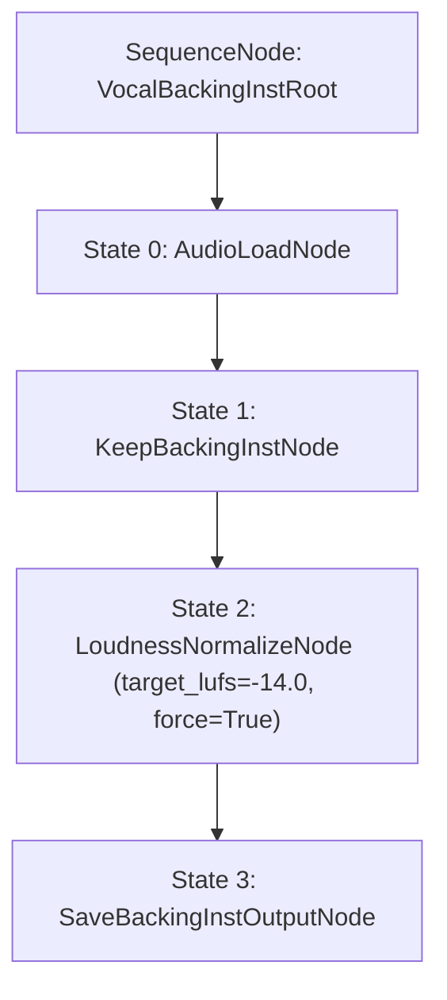

#### 🔑 Blackboard 黑板資料契約 (Blackboard State Contract)

| Key Name | Data Type | Source Node | Consumer Node | 說明 |
|---|---|---|---|---|
| `audio_path` | `str` | UI / User Input | `AudioLoadNode` | 原始原曲音檔路徑 |
| `backing_inst_path` | `str` | `SaveBackingInstOutputNode` | Web UI | 帶和聲伴奏 WAV 落盤路徑 (`Instrumental_With_Backing.wav`) |

---

### 3-3. 主唱與和聲雙軌獨立分離工作流 (`vocal_lead_backing_split`)

#### 🎯 目標與聲學指標
- **目標**：將歌曲人聲精細二分解構為「純主唱 (Lead Vocal)」與「純和聲軌 (Backing Vocals)」。

#### 🧬 狀態機 Behavior Tree 鏈路圖 (Node Chain)

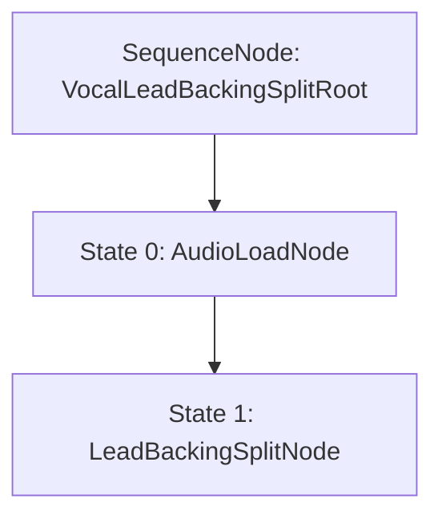

#### 🔑 Blackboard 黑板資料契約 (Blackboard State Contract)

| Key Name | Data Type | Source Node | Consumer Node | 說明 |
|---|---|---|---|---|
| `audio_path` | `str` | UI / User Input | `AudioLoadNode` | 原始原曲音檔路徑 |
| `lead_vocal_path` | `str` | `LeadBackingSplitNode` | Web UI | 抽離出之純主唱檔 (`Lead_Vocal_Only.wav`) |
| `backing_vocal_path` | `str` | `LeadBackingSplitNode` | Web UI | 抽離出之純和聲檔 (`Backing_Vocals_Only.wav`) |

---

### 3-4. 人聲乾聲去殘響與聲音純化工作流 (`vocal_dereverb_clean`)

#### 🎯 目標與聲學指標
- **目標**：剝離人聲軌中過重之房間 Echo 迴音與背景雜音，產出極致錄音室純淨乾聲。

#### 🧬 狀態機 Behavior Tree 鏈路圖 (Node Chain)

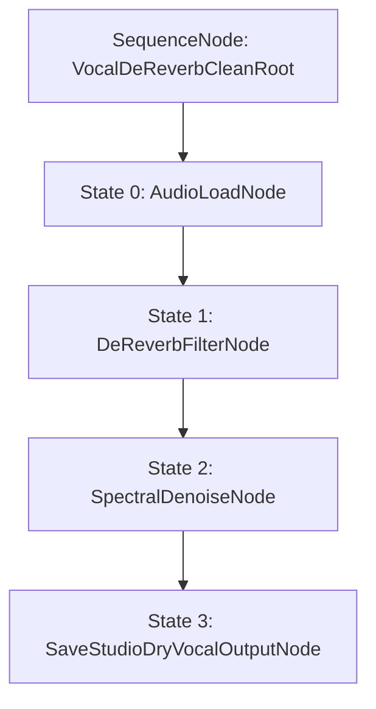

#### 🔑 Blackboard 黑板資料契約 (Blackboard State Contract)

| Key Name | Data Type | Source Node | Consumer Node | 說明 |
|---|---|---|---|---|
| `audio_path` | `str` | UI / User Input | `AudioLoadNode` | 原始人聲音檔路徑 |
| `studio_vocal_path` | `str` | `SaveStudioDryVocalOutputNode` | Web UI | 極致純化去殘響之錄音室乾聲檔 (`Studio_Dry_Vocal.wav`) |

---

## 🎼 大場景 4：音樂採譜與樂器樂理分析 (Transcribe & Analysis)

### 4-1. 鋼琴/吉他獨奏與多音音符自動轉 MIDI 工作流 (`transcribe_instrument_midi`)

#### 🎯 目標與聲學指標
- **目標**：將獨奏演奏錄音分析為音高、起音與力度，導出標準 MIDI 音符軌與 JSON 文字報告。

#### 🧬 狀態機 Behavior Tree 鏈路圖 (Node Chain)

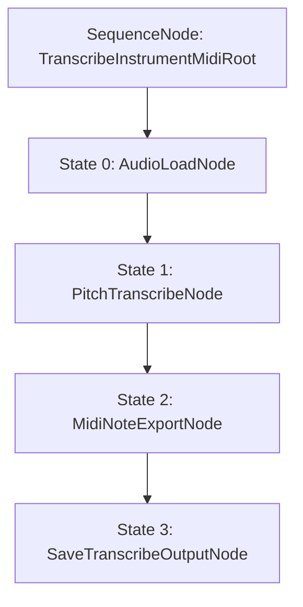

#### 🔑 Blackboard 黑板資料契約 (Blackboard State Contract)

| Key Name | Data Type | Source Node | Consumer Node | 說明 |
|---|---|---|---|---|
| `audio_path` | `str` | UI / User Input | `AudioLoadNode` | 原始獨奏/演奏音檔路徑 |
| `transcribed_midi_path` | `str` | `MidiNoteExportNode` | Web UI | 導出之 MIDI 檔路徑 (`Transcribed_Melody.mid`) |
| `transcription_json_path` | `str` | `SaveTranscribeOutputNode` | Web UI | 採譜 JSON 報告路徑 (`transcription_notes.json`) |

---

### 4-2. 爵士/流行樂曲和弦與調性分析報告工作流 (`transcribe_chord_key`)

#### 🎯 目標與聲學指標
- **目標**：計算 12 音階色譜與小節結構，估算主調性 (Key) 與和弦進程 (Chord Progression)。

#### 🧬 狀態機 Behavior Tree 鏈路圖 (Node Chain)

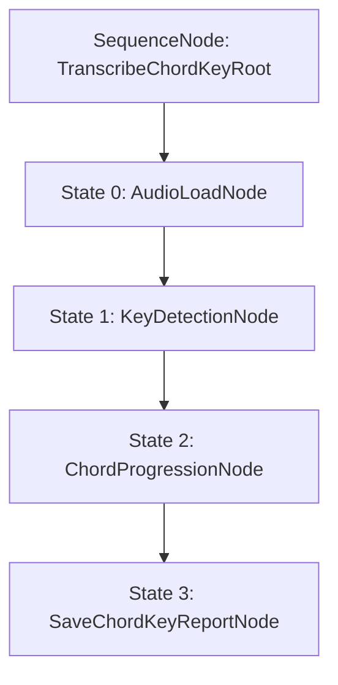

#### 🔑 Blackboard 黑板資料契約 (Blackboard State Contract)

| Key Name | Data Type | Source Node | Consumer Node | 說明 |
|---|---|---|---|---|
| `audio_path` | `str` | UI / User Input | `AudioLoadNode` | 原始輸入音檔路徑 |
| `estimated_key` | `str` | `KeyDetectionNode` | Web UI / Report | 分析估算主調性 (如 `C Major`) |
| `chord_key_json_path` | `str` | `SaveChordKeyReportNode` | Web UI | 和弦與調性結構分析 JSON 報告路徑 (`chord_key_analysis.json`) |

---

### 4-3. 爵士鼓與打擊樂器節拍聲軌採譜工作流 (`transcribe_drum_pattern`)

#### 🎯 目標與聲學指標
- **目標**：分析爵士鼓對位與起音打卡點 (Kick, Snare, Hi-Hat)，導出鼓 MIDI 音符軌與 JSON 報告。

#### 🧬 狀態機 Behavior Tree 鏈路圖 (Node Chain)

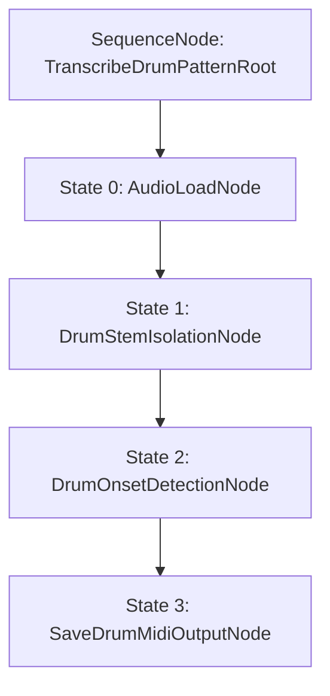

#### 🔑 Blackboard 黑板資料契約 (Blackboard State Contract)

| Key Name | Data Type | Source Node | Consumer Node | 說明 |
|---|---|---|---|---|
| `audio_path` | `str` | UI / User Input | `AudioLoadNode` | 原始輸入音檔路徑 |
| `drum_midi_path` | `str` | `SaveDrumMidiOutputNode` | Web UI | 爵士鼓 MIDI 軌路徑 (`Drum_Track.mid`) |
| `drum_json_path` | `str` | `SaveDrumMidiOutputNode` | Web UI | 爵士鼓打擊點 JSON 報告路徑 (`drum_pattern_report.json`) |

---

## 🎸 大場景 5：現場 Live PGM 與舞台軌道編排 (Live PGM & Stage Production)

### 5-1. Live 舞台 Multi-Track 全分軌 DAW 素材包導出工作流 (`live_multitrack_package`)

#### 🎯 目標與聲學指標
- **目標**：解構廣播級全分軌音軌，完成 Sub-Bass 40-100Hz 聲學低頻相位對位，封裝為一鍵導出 DAW 專案素材包 (`pgm_project_package.zip`)。

#### 🧬 狀態機 Behavior Tree 鏈路圖 (Node Chain)

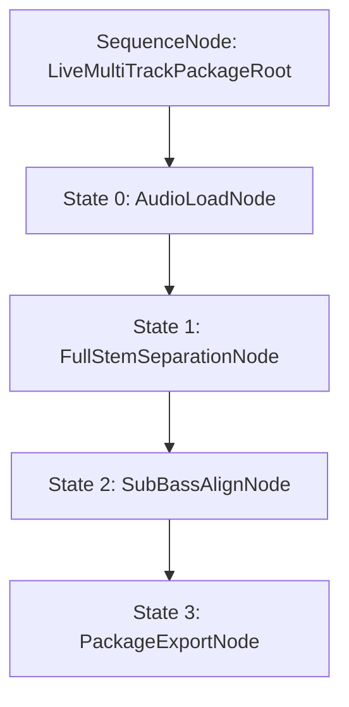

#### 🔑 Blackboard 黑板資料契約 (Blackboard State Contract)

| Key Name | Data Type | Source Node | Consumer Node | 說明 |
|---|---|---|---|---|
| `audio_path` | `str` | UI / User Input | `AudioLoadNode` | 原始原曲音檔路徑 |
| `zip_package_path` | `str` | `PackageExportNode` | Web UI | 封裝落盤之廣播級 PGM DAW 素材包 Zip 檔 (`pgm_project_package.zip`) |

---

### 5-2. 舞台導聽 Click & Cue Voice 指示音軌自動生成工作流 (`live_click_cue_gen`)

#### 🎯 目標與聲學指標
- **目標**：自動對位追蹤節拍與 Downbeats，合成樂段變更與倒數之語音 Cue 音軌與 Click 獨立對位軌。

#### 🧬 狀態機 Behavior Tree 鏈路圖 (Node Chain)

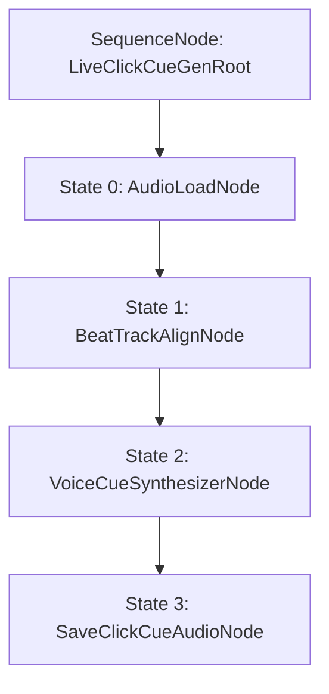

#### 🔑 Blackboard 黑板資料契約 (Blackboard State Contract)

| Key Name | Data Type | Source Node | Consumer Node | 說明 |
|---|---|---|---|---|
| `audio_path` | `str` | UI / User Input | `AudioLoadNode` | 原始原曲音檔路徑 |
| `click_track_path` | `str` | `SaveClickCueAudioNode` | Web UI | 精準 Click 節拍對位聲軌 (`click_track.wav`) |
| `cue_track_path` | `str` | `SaveClickCueAudioNode` | Web UI | 樂段與倒數語音 Cue 聲軌 (`cue_track.wav`) |

