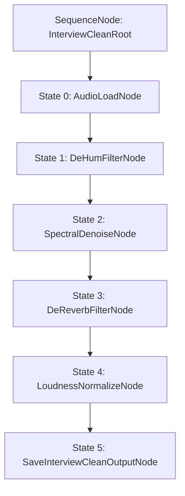

# PGMCraft Studio — 兩階層狀態機工作流 SDD 規範文件 (Workflow State Machine Architecture)

## 📌 概述
本文件為 PGMCraft Studio 音訊處理系統中 **「兩階層目標驅動應用場景狀態機 (Two-Tier Scenario State Machines)」** 之正式 SDD 設計規範。
每一條工作流均由一組獨立的 **Behavior Tree (BT) 狀態機** 驅動，嚴格遵照單一責任原則、Blackboard 狀態讀寫與極限聲學護航防護。

---

## 🎙️ 大場景 1：Podcast 播客與口播節目 (Podcasting & Speech)

### 1-1. 雙人/多人訪談聲音淨化工作流 (`podcast_interview_clean`)

#### 🎯 目標與聲學指標
- **目標**：修復帶有空調風聲、低頻 50/60Hz 電流聲、房間迴音與聲音大小不均的訪談錄音。
- **目標 LUFS**：`-16.0 LUFS` (Podcast 國際廣播規範)
- **True Peak 護航**：`-1.0 dBFS` (防止解碼器 True Peak 剪峰失真)

#### 🧬 狀態機 Behavior Tree 鏈路圖 (Node Chain)

#### 🔑 Blackboard 黑板資料契約 (Blackboard State Contract)

| Key Name | Data Type | Source Node | Consumer Node | 說明 |
|---|---|---|---|---|
| `audio_path` | `str` | UI / User Input | `AudioLoadNode` | 原始輸入音檔路徑 |
| `y` | `np.ndarray` | `AudioLoadNode` | `DeHum`, `Denoise`, `DeReverb`, `Normalize` | 音訊時域浮點波形 (float32) |
| `sr` | `int` | `AudioLoadNode` | `DeHum`, `Denoise`, `DeReverb`, `Normalize` | 音訊採樣率 (Hz) |
| `target_lufs` | `float` | `LoudnessNormalizeNode` | `LoudnessNormalizeNode` | 預設為 `-16.0 LUFS` |
| `clean_speech_path` | `str` | `SaveInterviewCleanOutputNode` | Web UI / Downloader | 淨化完成之 WAV 音檔落盤路徑 |

#### 🛡️ 異常與衛兵保護 (Guards & Fallbacks)
1. **直流偏置 (DC Offset Guard)**：`LoudnessNormalizeNode` 自動先清算 10Hz 低通濾波偏置，避免音圈偏移。
2. **單/雙聲道自動適應 (Channel Auto-shape)**：`SaveInterviewCleanOutputNode` 自動探測波形維度 (1D / 2D)，防止音軌 shape 轉置錯位。
